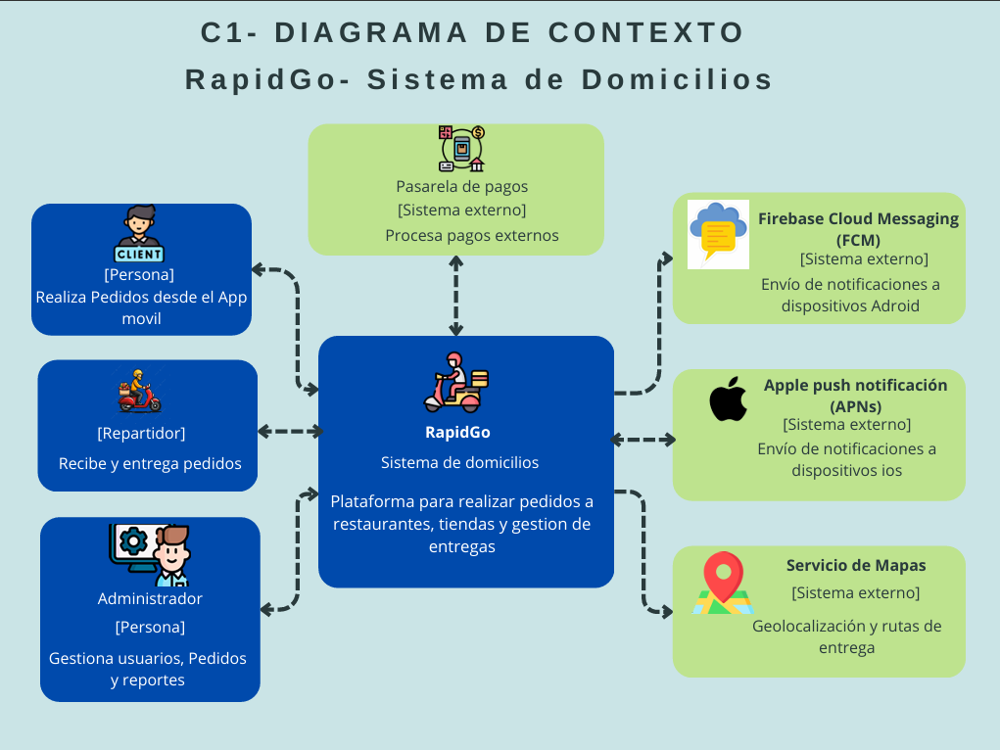
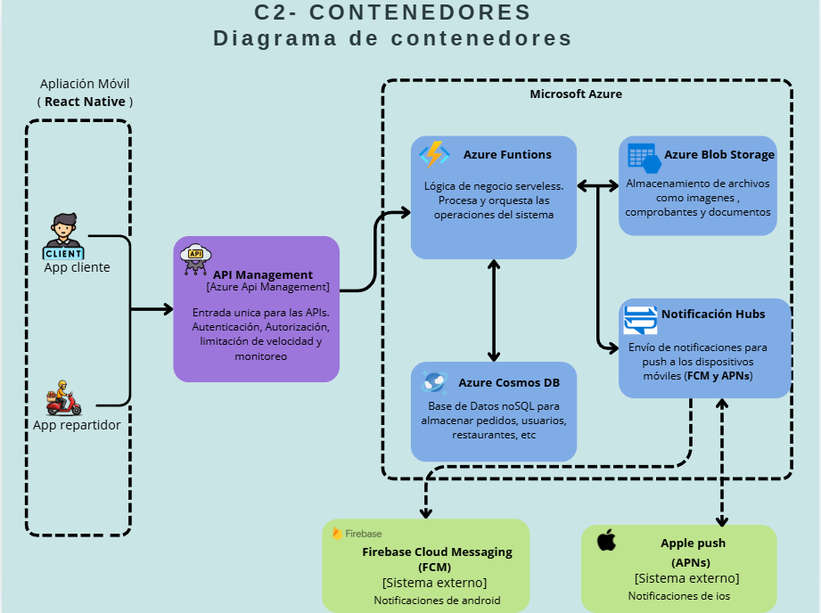
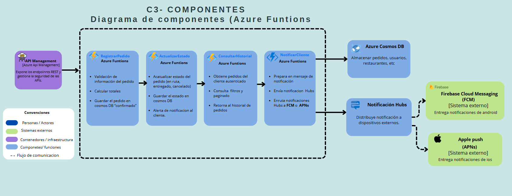

# Entrega2-rapidgo-serverless-backend

## Arquitectura Cloud en Microsoft Azure

**Curso:** Computación en la Nube
**Institución:** Tecnológico de Antioquia — Institución Universitaria

**Profesor:** Julian David Florez Sanchez

**Integrantes del grupo:**

* Alejandro Guaman
* Juan Pablo
* Juan Carlos Montiel
* Nombre Estudiante 4
* Nombre Estudiante 5

**Fecha de entrega:** 14 de mayo de 2026

---

# 1. Introducción

RapidGo es una startup colombiana dedicada al servicio de domicilios que conecta clientes con restaurantes y tiendas locales mediante una aplicación móvil desarrollada en React Native. Actualmente la plataforma opera en ciudades como Medellín, Manizales y Pereira.

El sistema actual utiliza una arquitectura monolítica desarrollada en Node.js desplegada en un servidor dedicado, lo cual ha generado múltiples problemas relacionados con escalabilidad, costos operativos y disponibilidad del servicio.

El objetivo de este proyecto es diseñar e implementar una arquitectura **serverless en la nube utilizando Microsoft Azure**, que permita mejorar la escalabilidad, reducir costos mediante un modelo de pago por uso y garantizar alta disponibilidad del sistema.

---

# 2. Arquitectura Propuesta

La arquitectura propuesta se basa en un enfoque **Serverless**, donde los componentes principales del backend se ejecutan bajo demanda utilizando servicios administrados en la nube.

Los servicios utilizados en la solución son:

* Azure Functions para la lógica de negocio
* API Management como puerta de entrada a la API
* Cosmos DB como base de datos NoSQL
* Blob Storage para almacenamiento de archivos
* Notification Hubs para envío de notificaciones push

Esta arquitectura permite que el sistema escale automáticamente según la demanda, eliminando la necesidad de administrar servidores físicos o máquinas virtuales.

---

# 3. Modelo C4

El modelo C4 permite representar la arquitectura del sistema en diferentes niveles de detalle.

## C1 — Diagrama de Contexto

Este diagrama muestra el sistema RapidGo como una caja negra y su interacción con los actores y sistemas externos.

**Actores principales**

* Cliente
* Repartidor
* Administrador

**Sistemas externos**

* Aplicación móvil React Native
* Firebase Cloud Messaging (FCM)
* Apple Push Notification Service (APNs)
* Pasarela de pagos

---

## C2 — Diagrama de Contenedores

El diagrama de contenedores muestra los principales servicios que componen la arquitectura del sistema.

**Componentes principales**

* API Management
* Azure Functions
* Cosmos DB
* Blob Storage
* Notification Hubs

---

## C3 — Diagrama de Componentes

Este diagrama describe los componentes internos de la capa de lógica de negocio implementada con Azure Functions.

**Funciones principales**

* registrarPedido
* actualizarEstado
* consultarHistorial
* notificarCliente

---

# 4. Decisiones Arquitectónicas (ADR)

## ADR-01 Uso de Azure Functions para la lógica de negocio

### Contexto

El sistema RapidGo necesita una arquitectura que permita escalar automáticamente durante picos de demanda sin intervención manual y que reduzca los costos operativos.

### Alternativas evaluadas

* Azure App Service
* Azure Functions

### Decisión

Se decidió utilizar Azure Functions debido a su modelo serverless que permite escalar automáticamente y operar bajo un modelo de pago por ejecución.

### Consecuencias

**Ventajas**

* Escalabilidad automática
* Reducción de costos
* Menor administración de infraestructura

**Desventajas**

* Posibles tiempos de arranque en frío (cold start)

---

## ADR-02 Cosmos DB vs Azure SQL Database

### Contexto

El sistema requiere almacenar información de pedidos y usuarios con alta disponibilidad y baja latencia.

### Alternativas evaluadas

* Azure SQL Database
* Cosmos DB

### Decisión

Se seleccionó Cosmos DB debido a su modelo NoSQL altamente escalable y su capacidad de manejar grandes volúmenes de datos distribuidos.

### Consecuencias

**Ventajas**

* Alta escalabilidad
* Baja latencia
* Modelo flexible de datos

---

## ADR-03 API Management como gateway de la API

### Contexto

El sistema requiere un punto de entrada centralizado para gestionar autenticación, seguridad y control de tráfico.

### Alternativas evaluadas

* Exponer directamente Azure Functions
* Usar API Management

### Decisión

Se eligió API Management para proporcionar un gateway centralizado para la API.

---

## ADR-04 Uso de Blob Storage para almacenamiento de archivos

Blob Storage permite almacenar imágenes de productos, comprobantes de entrega y reportes del sistema de forma segura y escalable.

---

## ADR-05 Notification Hubs para notificaciones push

Notification Hubs permite enviar notificaciones en tiempo real a dispositivos Android y iOS utilizando FCM y APNs.

---

# 5. Implementación

El flujo principal del sistema consiste en el procesamiento de pedidos desde la aplicación móvil.

**Flujo implementado**

1. El cliente realiza una solicitud **POST /pedidos** a través de API Management.
2. La solicitud es procesada por una Azure Function llamada **registrarPedido**.
3. El pedido se almacena en Cosmos DB con estado **confirmado**.
4. Cuando el estado cambia, se ejecuta la función **actualizarEstado**.
5. Se envía una notificación al cliente utilizando Notification Hubs.

Las pruebas de los endpoints se realizaron utilizando Postman.

---

# 6. Evidencias

Las siguientes capturas muestran la implementación del sistema en Azure.

## Recursos desplegados en Azure

## Ejecución de Azure Functions

## Documento almacenado en Cosmos DB

## Notificación enviada al cliente

---

# 7. Conclusiones

La implementación de una arquitectura serverless en Microsoft Azure permitió resolver los principales problemas del sistema monolítico original.

Entre los beneficios obtenidos se destacan:

* Escalabilidad automática durante picos de demanda.
* Reducción de costos operativos mediante el modelo de pago por uso.
* Mayor disponibilidad del sistema gracias a los servicios administrados de Azure.
* Mayor flexibilidad para el desarrollo y despliegue de nuevas funcionalidades.

Además, el uso del modelo C4 permitió documentar la arquitectura de forma clara, facilitando la comprensión del sistema para desarrolladores y arquitectos de software.

Como trabajo futuro, se podría integrar un sistema de monitoreo avanzado utilizando Azure Monitor y Application Insights para mejorar la observabilidad del sistema.

- Reducción de costos mediante un modelo de pago por uso
- Alta disponibilidad del sistema
- Simplificación en la administración de infraestructura

Esta arquitectura proporciona una base sólida para el crecimiento futuro de la plataforma RapidGo.
