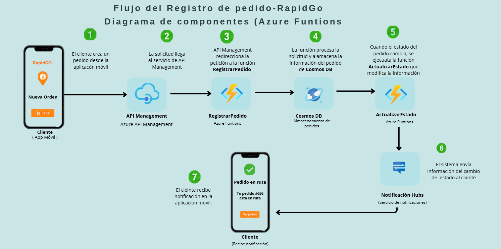

# Entrega 2 – RapidGo Serverless Backend

## Arquitectura Cloud en Microsoft Azure

Curso: Computación en la Nube
Institución: Tecnológico de Antioquia – Institución Universitaria
Profesor: Julian David Florez Sanchez

Integrantes del grupo

* Alejandro Guzman
* Juan Pablo
* Juan Carlos Montiel
* Estudiante 4
* Estudiante 5

Fecha de entrega: 14 de mayo de 2026

## 1. Introducción

RapidGo es una empresa colombiana que ofrece servicios de domicilios mediante una aplicación móvil que conecta a los clientes con restaurantes y tiendas locales. La aplicación fue desarrollada utilizando React Native y actualmente opera en ciudades como Medellín, Manizales y Pereira.

La versión actual del sistema utiliza una arquitectura monolítica desarrollada con Node.js y desplegada en un servidor dedicado. Este enfoque ha generado algunas limitaciones importantes, especialmente en aspectos como la escalabilidad del sistema, los costos de infraestructura y la disponibilidad del servicio cuando aumenta el número de usuarios.

Por esta razón, en este proyecto se propone el diseño de una arquitectura basada en servicios **serverless utilizando Microsoft Azure**, con el objetivo de mejorar la escalabilidad, reducir los costos operativos y aumentar la disponibilidad del sistema.

## 2. Arquitectura Propuesta

La solución propuesta se basa en el uso de una arquitectura serverless. En este modelo, las funciones del backend se ejecutan bajo demanda utilizando servicios administrados en la nube, lo que elimina la necesidad de administrar servidores manualmente.

Para la implementación se consideran los siguientes servicios de Azure:

* Azure Functions para ejecutar la lógica del sistema
* API Management como punto de acceso a la API
* Cosmos DB para el almacenamiento de datos NoSQL
* Blob Storage para almacenar archivos
* Notification Hubs para el envío de notificaciones push a los usuarios

Con este enfoque, la plataforma puede escalar automáticamente según el número de solicitudes que reciba la aplicación.

## 3. Modelo C4

El modelo C4 permite representar la arquitectura del sistema en diferentes niveles de detalle para facilitar su comprensión.

### C1 – Diagrama de Contexto

Este diagrama muestra cómo interactúa el sistema RapidGo con los actores principales y con otros servicios externos.

Actores del sistema

* Cliente
* Repartidor
* Administrador

Servicios externos

* Aplicación móvil desarrollada en React Native
* Firebase Cloud Messaging
* Apple Push Notification Service
* Pasarela de pagos

### C2 – Diagrama de Contenedores

En este nivel se muestran los contenedores principales que forman parte de la arquitectura del sistema.

Entre los componentes principales se encuentran:

* API Management
* Azure Functions
* Cosmos DB
* Blob Storage
* Notification Hubs

### C3 – Diagrama de Componentes

El diagrama de componentes describe los elementos internos que forman parte de la capa de lógica de negocio.

Funciones principales implementadas

* registrarPedido
* actualizarEstadoPedido
* consultarHistorialPedidos
* enviarNotificacionCliente

## 4. Decisiones Arquitectónicas (ADR)

### ADR 01 – Uso de Azure Functions

Se decidió utilizar Azure Functions para implementar la lógica del backend debido a que permite trabajar bajo un modelo serverless, lo cual facilita la escalabilidad automática y reduce la administración de infraestructura.

### ADR 02 – Uso de Cosmos DB

Cosmos DB fue seleccionada como base de datos principal porque permite manejar grandes volúmenes de datos con baja latencia y ofrece un modelo flexible de almacenamiento NoSQL.

### ADR 03 – Uso de API Management

API Management funciona como un punto de entrada para todas las solicitudes de la aplicación, permitiendo controlar el acceso, aplicar seguridad y administrar el tráfico de la API.

### ADR 04 – Uso de Blob Storage

Blob Storage se utiliza para almacenar archivos como imágenes de productos, comprobantes de entrega y otros recursos que requiere la plataforma.

### ADR 05 – Uso de Notification Hubs

Notification Hubs permite enviar notificaciones a dispositivos móviles Android y iOS utilizando servicios como Firebase Cloud Messaging y Apple Push Notification Service.

## 5. Implementación

El flujo principal del sistema se centra en el proceso de registro de pedidos desde la aplicación móvil.

### Proceso general

1. El cliente envía una solicitud para crear un pedido desde la aplicación móvil.
2. La solicitud llega al servicio de API Management.
3. API Management redirige la petición a una Azure Function llamada **registrarPedido**.
4. La función procesa la solicitud y almacena la información del pedido en **Cosmos DB**.
5. Cuando el estado del pedido cambia, se ejecuta una función llamada **actualizarEstado** que modifica la información del pedido.
6. Finalmente, el sistema envía una notificación al cliente utilizando **Notification Hubs**.

Las pruebas de los servicios se realizaron utilizando la herramienta **Postman**, permitiendo verificar el correcto funcionamiento de los endpoints y la comunicación entre los servicios del sistema.

### Flujo del registro de pedido

## 6. Evidencias

A continuación se presentan algunas capturas de pantalla que muestran el funcionamiento del sistema en el entorno de Azure.

Recursos creados en Azure

Ejecución de funciones

Registro de pedidos en Cosmos DB

Notificación enviada al cliente

## 7. Conclusiones

La propuesta de una arquitectura serverless en Microsoft Azure permite mejorar significativamente el funcionamiento del sistema RapidGo en comparación con la arquitectura monolítica original.

Entre los beneficios más importantes se encuentran la escalabilidad automática del sistema, la reducción de costos operativos y la mejora en la disponibilidad de la plataforma.

Además, el uso del modelo C4 permitió representar la arquitectura del sistema de manera clara, facilitando la comprensión de sus componentes y de la forma en que interactúan entre sí.

Como trabajo futuro, sería posible integrar herramientas de monitoreo como Azure Monitor y Application Insights para mejorar el seguimiento y análisis del rendimiento del sistema.
