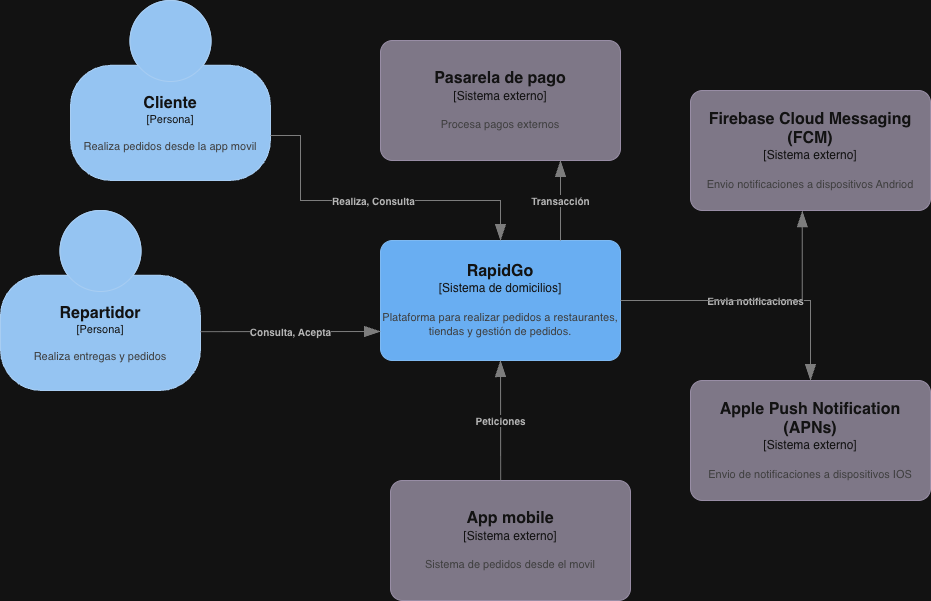
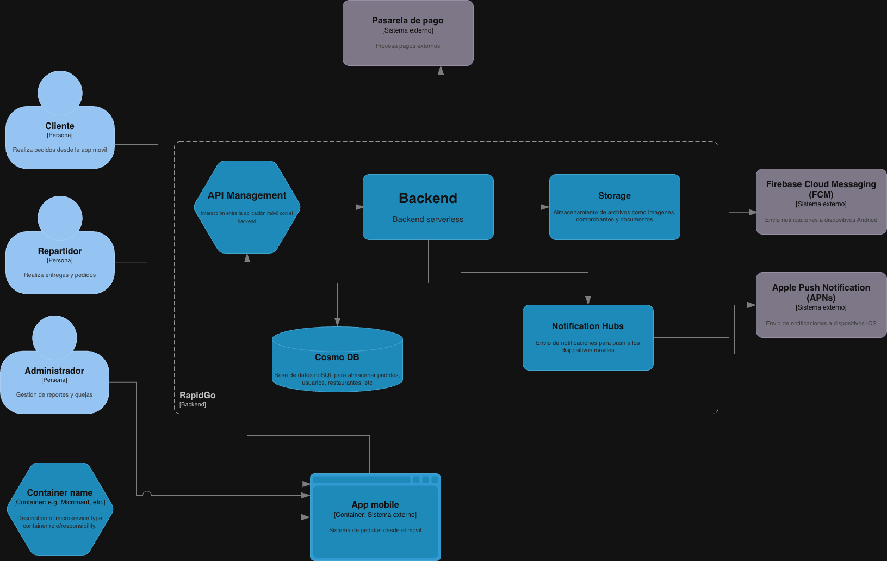
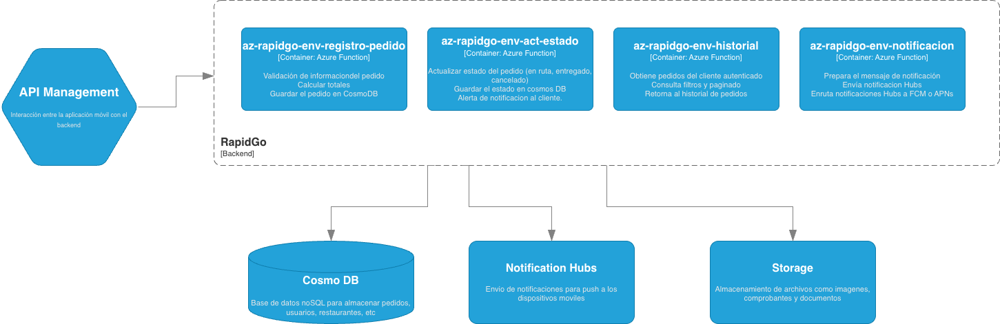
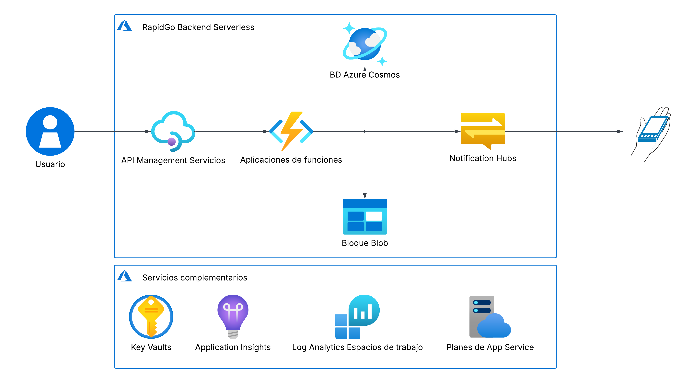

# RapidGo Serverless Backend

Plataforma colombiana de domicilios con backend serverless en Microsoft Azure. Conecta clientes, repartidores y comercios locales mediante una arquitectura orientada a eventos, escalable automáticamente y optimizada para notificaciones push en tiempo real.

---

## Modelo C4

El modelo C4 representa la arquitectura del sistema en cuatro niveles de abstracción, facilitando la comunicación entre los equipos técnicos y de negocio.

### C1 – Diagrama de Contexto

Interacción del sistema RapidGo con los actores principales (cliente, repartidor, administrador) y servicios externos (React Native, FCM, APNs, pasarela de pagos).

### C2 – Diagrama de Contenedores

Componentes principales de la arquitectura: API Management, Azure Functions, Cosmos DB, Blob Storage y Notification Hubs.

### C3 – Diagrama de Componentes

Descomposición interna de la capa de lógica de negocio, mostrando las funciones implementadas y sus relaciones.

---

## Decisiones Arquitectónicas (ADR)

Las decisiones arquitectónicas fundamentales se documentan en archivos individuales dentro de [`assets/ADRS/`](assets/ADRS/). Cada ADR incluye el contexto, las alternativas evaluadas, la decisión adoptada y sus consecuencias.

| # | Título | Archivo |
|---|---|---|
| ADR-001 | Uso de Azure Functions (Serverless) sobre Azure App Service | [`assets/ADRS/ADR 1.md`](assets/ADRS/ADR_1.md) |
| ADR-002 | Cosmos DB como sistema de almacenamiento principal | [`assets/ADRS/ADR 2.md`](assets/ADRS/ADR_2.md) |
| ADR-003 | API Management como gateway de entrada | [`assets/ADRS/ADR 3.md`](assets/ADRS/ADR_3.md) |
| ADR-004 | Azure Blob Storage sobre Azure Files para almacenamiento | [`assets/ADRS/ADR 4.md`](assets/ADRS/ADR_4.md) |
| ADR-005 | Azure Notification Hubs sobre Azure Communication Services | [`assets/ADRS/ADR 5.md`](assets/ADRS/ADR_5.md) |

Cada archivo contiene la evaluación técnica completa con tabla de puntuación por requerimiento no funcional y justificación detallada.

---

---

## Arquitectura Cloud

La solución se fundamenta en una arquitectura serverless nativa de Azure. Las funciones del backend se ejecutan bajo demanda mediante servicios administrados, eliminando la gestión manual de servidores y adaptando la capacidad del sistema a la carga de trabajo en tiempo real.

Principios arquitectónicos:

- **Arquitectura orientada a eventos**: cada operación del sistema (registro de pedido, cambio de estado, notificación) se modela como un evento que dispara funciones específicas.
- **Escalabilidad automática**: Azure Functions escala horizontalmente según el volumen de solicitudes sin intervención manual.
- **Pago por uso**: solo se facturan los recursos consumidos durante la ejecución, eliminando costos fijos de infraestructura ociosa.
- **Alta disponibilidad**: los servicios administrados de Azure garantizan SLAs de disponibilidad y replicación geográfica opcional.
- **Desacoplamiento de servicios**: cada componente del sistema es independiente, permitiendo desarrollar, desplegar y escalar cada uno por separado.
- **Backend serverless**: la lógica de negocio se implementa mediante Azure Functions, eliminando la necesidad de aprovisionar o mantener servidores.

---

## Arquitectura de Solución

### Azure Functions

**Propósito**: ejecutar la lógica de negocio del sistema en un entorno serverless.

Las funciones implementan los casos de uso principales como `registrarPedido`, `actualizarEstadoPedido`, `consultarHistorialPedidos` y `enviarNotificacionCliente`. Cada función se activa mediante peticiones HTTP a través de API Management o mediante cambios en los datos.

**Beneficios técnicos**: escalado automático, aislamiento por función, integración nativa con el ecosistema Azure y facturación por ejecución.

### Azure API Management

**Propósito**: actuar como punto de entrada único para todas las solicitudes de la aplicación móvil.

Gestiona el enrutamiento, la autenticación, el rate limiting y la transformación de peticiones antes de que lleguen a las Azure Functions. Expone una fachada REST consistente hacia los clientes.

**Beneficios técnicos**: seguridad centralizada, control de tráfico, documentación interactiva de la API y compatibilidad con políticas de transformación.

### Azure Cosmos DB

**Propósito**: almacenar y consultar los datos de la plataforma (pedidos, usuarios, comercios) con baja latencia.

Se utiliza como base de datos NoSQL con modelo de datos flexible, ideal para los documentos JSON que maneja la aplicación.

**Beneficios técnicos**: latencias de milisegundos de un solo dígito, distribución global multi-región, escalado elástico del rendimiento y SLAs integrales.

### Azure Blob Storage

**Propósito**: almacenar archivos no estructurados como imágenes de productos, comprobantes de entrega y recursos estáticos de la plataforma.

**Beneficios técnicos**: almacenamiento durable y redundante, escalabilidad masiva, acceso seguro mediante SAS tokens y costos optimizados por nivel de acceso.

### Azure Notification Hubs

**Propósito**: gestionar el envío de notificaciones push a los dispositivos móviles de clientes y repartidores.

Se integra con Firebase Cloud Messaging (FCM) para dispositivos Android y con Apple Push Notification Service (APNs) para iOS, permitiendo un único punto de administración para todas las notificaciones.

**Beneficios técnicos**: envío masivo escalable, soporte multiplataforma (FCM, APNs), personalización por etiqueta y segmentación de audiencias.

## Stack Tecnológico

| Capa | Tecnología |
|---|---|
| Backend serverless | Azure Functions (Node.js) |
| API Gateway | Azure API Management |
| Base de datos | Azure Cosmos DB (NoSQL) |
| Almacenamiento de archivos | Azure Blob Storage |
| Notificaciones push | Azure Notification Hubs |
| Cliente móvil | React Native |
| Push Android | Firebase Cloud Messaging (FCM) |
| Push iOS | Apple Push Notification Service (APNs) |
| Pruebas de API | Postman |

---

## Diagrama de Arquitectura

Visión general de la arquitectura de la solución RapidGo Backend Serverless, mostrando el flujo de datos desde el usuario a través de los servicios Azure principales y los servicios complementarios de soporte.

---

## Consecuencias y Trade-offs Arquitectónicos

### Impacto directo en RapidGo

- **Eliminación de cancelaciones por saturación**: La escalabilidad automática de Azure Functions resuelve el problema crítico donde el servidor monolítico actual supera los 8 segundos de respuesta en horas pico (12m-2pm y 6pm-9pm), eliminando las cancelaciones espontáneas que representan el 12% del tráfico y protegiendo los ingresos por comisión del 18%.
- **Reducción de $4.200.000 COP a <$50 USD mensuales**: El modelo pago por uso de Consumption Plan + Free Tiers elimina el desperdicio de recursos en horas de baja demanda (2am-8am con 4% de CPU), liberando capital para invertir en crecimiento en las tres ciudades de operación (Medellín, Manizales, Pereira).
- **Protección de ingresos en horas pico**: Cada minuto de caída representa $180.000 COP en pérdidas. La alta disponibilidad nativa de Azure (SLA 99.9%) limita la inactividad máxima a 44 minutos mensuales, evitando caídas totales como las del servidor dedicado actual con tiempos de restauración de 2-6 horas.
- **Notificaciones confiables para repartidores y clientes**: La integración nativa con FCM y APNs mediante Notification Hubs eleva la tasa de entrega del 67% actual al >95% requerido, reduciendo la confusión sobre estados de pedidos y mejorando la experiencia de los 340 repartidores activos.
- **Actualizaciones sin afectar pedidos en curso**: Los despliegues zero-downtime de Azure Functions eliminan las ventanas de mantenimiento de 20-30 minutos que impactaban ventas nocturnas, permitiendo iterar rápidamente sin interrumpir los ~1.200 pedidos diarios promedio.

### Trade-offs específicos del contexto RapidGo

- **Migración ETL de 3 años de datos históricos**: Los datos en MySQL del monolito actual requieren transformación a documentos JSON para Cosmos DB. Este esfuerzo inicial de ingeniería de datos es necesario pero no bloquea la operación, ya que los pedidos nuevos pueden escribirse directamente en el nuevo modelo mientras se migra el histórico en paralelo.
- **Cold starts en primera invocación del día**: Las funciones en Consumption Plan pueden tardar 1-3 segundos en activarse tras periodos de inactividad (ej: primera orden de la mañana a las 6am). Para RapidGo esto es aceptable dado que el SLA de latencia es <800ms en P95 (no en p100), y se mitiga naturalmente con el volumen constante de pedidos durante el día.
- **Carga operativa del equipo de infraestructura (1 persona)**: La arquitectura serverless reduce drásticamente la administración manual (no hay servidores que parchear, escalar o monitorear a nivel de SO), pero requiere que el único ingeniero de infraestructura aprenda patrones de observabilidad en Azure (Application Insights, Log Analytics) para mantener la visibilidad del sistema.
- **Vendor lock-in en ecosistema Azure**: La dependencia de bindings nativos (Cosmos DB Change Feed, Notification Hubs, APIM policies) reduce la portabilidad a AWS o GCP. Para una startup en fase piloto con presupuesto limitado, este trade-off es aceptable: la prioridad es lanzar rápido y validar el modelo de negocio, no la portabilidad multi-cloud.
- **Limitaciones del Developer Tier en APIM**: El tier gratuito tiene restricciones de throughput y no incluye características avanzadas como caching o transformación compleja. Adecuado para la fase piloto (<$50 USD/mes), pero requerirá migración a Standard tier cuando RapidGo escale a más ciudades o supere los límites del tier gratuito.
- **Consistencia eventual en estados de pedidos**: Se prioriza latencia sobre consistencia fuerte en el flujo de notificaciones. Un repartidor podría ver un estado "en camino" milisegundos antes que el cliente, pero esto no afecta la operación real del domicilio y es preferible a bloquear la experiencia esperando consistencia fuerte.
- **Curva de aprendizaje para equipo Node.js/Python**: El equipo actual tiene experiencia en estos lenguajes, lo que facilita la implementación de Azure Functions en Node.js. Sin embargo, el cambio de paradigma de monolito a funciones efímeras sin estado requiere adaptación en patrones de diseño (ej: no mantener sesiones en memoria, usar Cosmos DB como estado compartido).

---

*Tecnológico de Antioquia — Institución Universitaria*  
*Computación en la Nube | Semestre 2026-1*  
*Profesor: Julian David Florez Sanchez*

