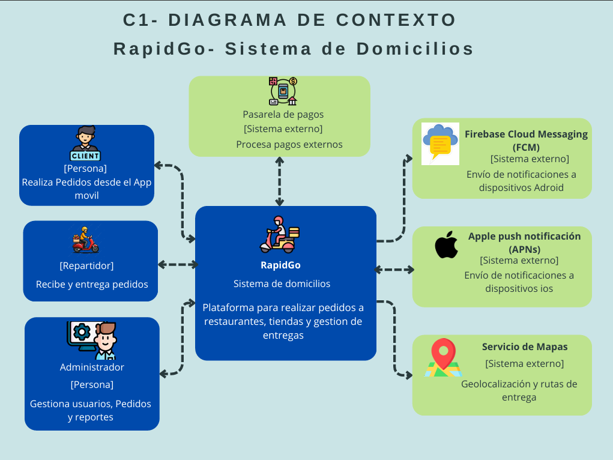
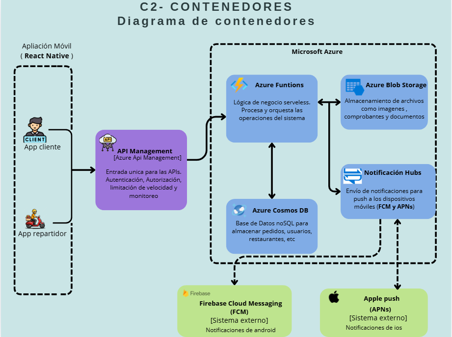
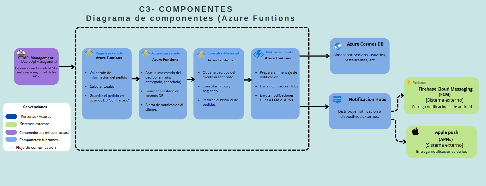
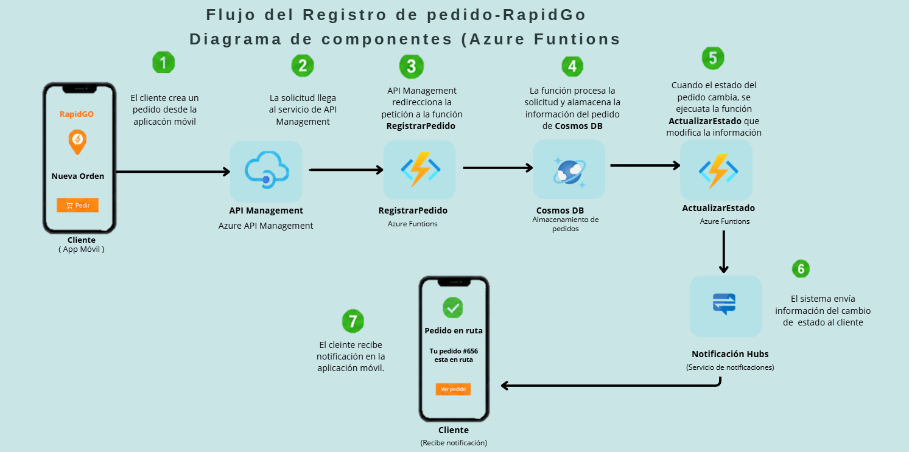

# RapidGo Serverless Backend

Plataforma colombiana de domicilios con backend serverless en Microsoft Azure. Conecta clientes, repartidores y comercios locales mediante una arquitectura orientada a eventos, escalable automáticamente y optimizada para notificaciones push en tiempo real.

---

## Arquitectura Cloud

La solución se fundamenta en una arquitectura serverless nativa de Azure. Las funciones del backend se ejecutan bajo demanda mediante servicios administrados, eliminando la gestión manual de servidores y adaptando la capacidad del sistema a la carga de trabajo en tiempo real.

Principios arquitectónicos:

- **Arquitectura orientada a eventos**: cada operación del sistema (registro de pedido, cambio de estado, notificación) se modela como un evento que dispara funciones específicas.
- **Escalabilidad automática**: Azure Functions escala horizontalmente según el volumen de solicitudes sin intervención manual.
- **Pago por uso**: solo se facturan los recursos consumidos durante la ejecución, eliminando costos fijos de infraestructura ociosa.
- **Alta disponibilidad**: los servicios administrados de Azure garantizan SLAs de disponibilidad y replicación geográfica opcional.
- **Desacoplamiento de servicios**: cada componente del sistema es independiente, permitiendo desarrollar, desplegar y escalar cada uno por separado.
- **Backend serverless**: la lógica de negocio se implementa mediante Azure Functions, eliminando la necesidad de aprovisionar o mantener servidores.

---

## Arquitectura de Solución

### Azure Functions

**Propósito**: ejecutar la lógica de negocio del sistema en un entorno serverless.

Las funciones implementan los casos de uso principales como `registrarPedido`, `actualizarEstadoPedido`, `consultarHistorialPedidos` y `enviarNotificacionCliente`. Cada función se activa mediante peticiones HTTP a través de API Management o mediante cambios en los datos.

**Beneficios técnicos**: escalado automático, aislamiento por función, integración nativa con el ecosistema Azure y facturación por ejecución.

### Azure API Management

**Propósito**: actuar como punto de entrada único para todas las solicitudes de la aplicación móvil.

Gestiona el enrutamiento, la autenticación, el rate limiting y la transformación de peticiones antes de que lleguen a las Azure Functions. Expone una fachada REST consistente hacia los clientes.

**Beneficios técnicos**: seguridad centralizada, control de tráfico, documentación interactiva de la API y compatibilidad con políticas de transformación.

### Azure Cosmos DB

**Propósito**: almacenar y consultar los datos de la plataforma (pedidos, usuarios, comercios) con baja latencia.

Se utiliza como base de datos NoSQL con modelo de datos flexible, ideal para los documentos JSON que maneja la aplicación.

**Beneficios técnicos**: latencias de milisegundos de un solo dígito, distribución global multi-región, escalado elástico del rendimiento y SLAs integrales.

### Azure Blob Storage

**Propósito**: almacenar archivos no estructurados como imágenes de productos, comprobantes de entrega y recursos estáticos de la plataforma.

**Beneficios técnicos**: almacenamiento durable y redundante, escalabilidad masiva, acceso seguro mediante SAS tokens y costos optimizados por nivel de acceso.

### Azure Notification Hubs

**Propósito**: gestionar el envío de notificaciones push a los dispositivos móviles de clientes y repartidores.

Se integra con Firebase Cloud Messaging (FCM) para dispositivos Android y con Apple Push Notification Service (APNs) para iOS, permitiendo un único punto de administración para todas las notificaciones.

**Beneficios técnicos**: envío masivo escalable, soporte multiplataforma (FCM, APNs), personalización por etiqueta y segmentación de audiencias.

---

## Objetivos de Arquitectura

| Objetivo | Descripción |
|---|---|
| Escalabilidad | El sistema escala horizontalmente de forma automática para absorber picos de demanda sin degradación del servicio. |
| Alta disponibilidad | Los servicios administrados de Azure garantizan SLAs de disponibilidad y continuidad del servicio frente a fallos. |
| Baja latencia | Cosmos DB ofrece tiempos de respuesta de milisegundos de un solo dígito para operaciones de lectura y escritura. |
| Zero-downtime deployment | El modelo serverless permite desplegar nuevas versiones de funciones sin interrumpir el servicio activo. |
| Push notifications en tiempo real | La integración de Notification Hubs con FCM y APNs garantiza la entrega inmediata de notificaciones a los dispositivos. |
| Optimización de costos | El modelo de pago por uso de Azure Functions elimina el costo de infraestructura ociosa, ajustando el gasto al consumo real. |
| Baja carga operativa | Al eliminar la administración de servidores, el equipo puede concentrarse en el desarrollo de funcionalidades de negocio. |

---

## Modelo C4

El modelo C4 representa la arquitectura del sistema en cuatro niveles de abstracción, facilitando la comunicación entre los equipos técnicos y de negocio.

### C1 – Diagrama de Contexto

Interacción del sistema RapidGo con los actores principales (cliente, repartidor, administrador) y servicios externos (React Native, FCM, APNs, pasarela de pagos).

### C2 – Diagrama de Contenedores

Componentes principales de la arquitectura: API Management, Azure Functions, Cosmos DB, Blob Storage y Notification Hubs.

### C3 – Diagrama de Componentes

Descomposición interna de la capa de lógica de negocio, mostrando las funciones implementadas y sus relaciones.

---

## Flujo de Negocio

El flujo principal del sistema es el registro y seguimiento de pedidos:

1. El cliente envía una solicitud de creación de pedido desde la aplicación React Native.
2. La solicitud ingresa a través de Azure API Management, que aplica políticas de seguridad y validación.
3. API Management enruta la petición a la Azure Function `registrarPedido`.
4. La función procesa la solicitud, aplica las reglas de negocio y persiste el pedido en Cosmos DB.
5. Cuando el estado del pedido cambia, la función `actualizarEstadoPedido` actualiza el registro en Cosmos DB.
6. El sistema envía una notificación push al cliente mediante Notification Hubs, utilizando FCM o APNs según la plataforma del dispositivo.

---

## Stack Tecnológico

| Capa | Tecnología |
|---|---|
| Backend serverless | Azure Functions (Node.js) |
| API Gateway | Azure API Management |
| Base de datos | Azure Cosmos DB (NoSQL) |
| Almacenamiento de archivos | Azure Blob Storage |
| Notificaciones push | Azure Notification Hubs |
| Cliente móvil | React Native |
| Push Android | Firebase Cloud Messaging (FCM) |
| Push iOS | Apple Push Notification Service (APNs) |
| Pruebas de API | Postman |

---

## Decisiones Arquitectónicas (ADR)

### ADR 001 — Azure Functions como plataforma de ejecución

**Contexto**: se requiere una plataforma para ejecutar la lógica de negocio del backend sin administrar servidores.

**Decisión**: se adopta Azure Functions por su modelo serverless, integración nativa con el ecosistema Azure, escalado automático y facturación por ejecución.

**Consecuencias**: las funciones se despliegan de forma independiente, permitiendo actualizaciones y escalado por separado. La latencia de arranque en frío (cold start) debe considerarse en funciones críticas.

---

### ADR 002 — Cosmos DB como sistema de almacenamiento principal

**Contexto**: la plataforma necesita una base de datos flexible, con baja latencia y capaz de manejar documentos JSON con esquemas variables.

**Decisión**: se selecciona Cosmos DB por su modelo NoSQL, latencias de milisegundos de un solo dígito, escalado elástico y SLAs de disponibilidad.

**Consecuencias**: se adopta un modelo de datos basado en documentos JSON. Las consultas complejas con múltiples joins pueden requerir refactorización hacia un modelo desnormalizado.

---

### ADR 003 — API Management como gateway de entrada

**Contexto**: es necesario centralizar el acceso a las funciones del backend, aplicar políticas de seguridad y gestionar el tráfico.

**Decisión**: se implementa Azure API Management como fachada única para todas las peticiones, proporcionando autenticación, rate limiting y transformación de mensajes.

**Consecuencias**: toda solicitud pasa por API Management antes de alcanzar las funciones, lo que añade una capa de seguridad pero también una latencia mínima adicional.

---

### ADR 004 — Blob Storage para almacenamiento de archivos

**Contexto**: la plataforma requiere almacenar imágenes de productos, comprobantes de entrega y otros archivos no estructurados.

**Decisión**: se utiliza Azure Blob Storage por su durabilidad, escalabilidad masiva y costos ajustables por nivel de acceso.

**Consecuencias**: el acceso a los archivos se controla mediante SAS tokens, eliminando la necesidad de exponer las credenciales de almacenamiento.

---

### ADR 005 — Notification Hubs para notificaciones push multiplataforma

**Contexto**: el sistema debe enviar notificaciones push en tiempo real a dispositivos Android e iOS sin gestionar conexiones individuales.

**Decisión**: se adopta Azure Notification Hubs como servicio centralizado que se integra con FCM y APNs, administrando el enrutamiento y la entrega de notificaciones.

**Consecuencias**: la plataforma envía notificaciones desde un único punto, independientemente del sistema operativo del dispositivo destino.

---

## Despliegue

La infraestructura se aprovisiona mediante recursos de Azure:

- **Azure Functions**: despliegue de las funciones desde el repositorio mediante publicación directa o integración con CI/CD.
- **Azure API Management**: importación de la especificación OpenAPI para definir los endpoints y políticas.
- **Azure Cosmos DB**: creación de la base de datos y colecciones con el rendimiento aprovisionado según la carga esperada.
- **Azure Blob Storage**: configuración de contenedores públicos y privados con políticas de acceso.
- **Azure Notification Hubs**: configuración de los hubs con las credenciales de FCM y APNs.

---

## Pruebas

Las pruebas de integración y validación de los endpoints se realizan mediante colecciones de Postman, verificando:

- Creación, consulta y actualización de pedidos.
- Envío de notificaciones push a dispositivos Android e iOS.
- Respuesta de los servicios ante cargas de trabajo concurrentes.
- Correcto funcionamiento de las políticas de seguridad en API Management.
