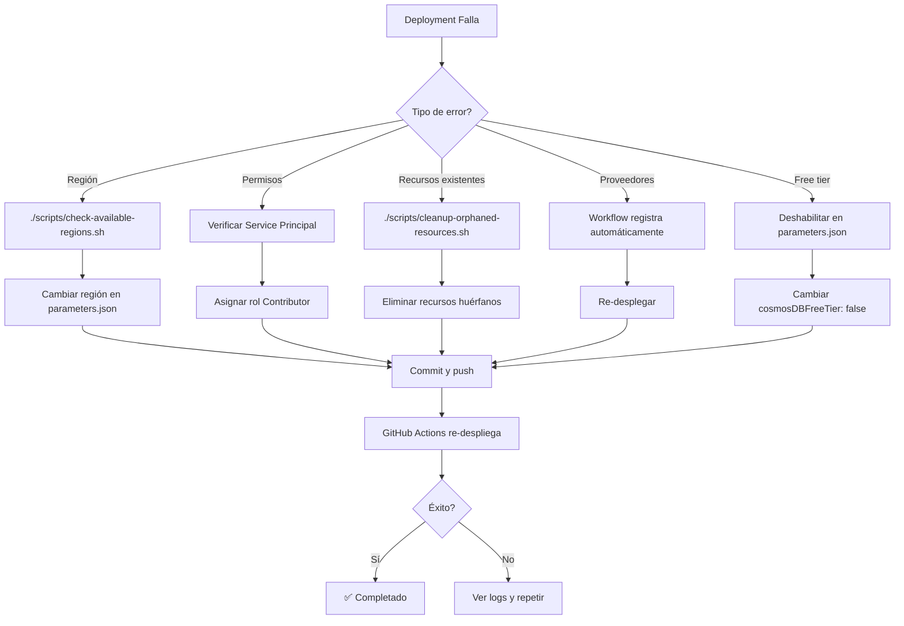

# Troubleshooting - RapidGo Infraestructura Azure

Guía de solución de problemas comunes durante el despliegue de infraestructura.

---

## 🔴 Error: "Property at path location cannot be changed"

### Causa
Recursos con nombres globales (Storage Account, Key Vault) ya existen en otra región.

### Solución

**Opción 1: Limpiar recursos huérfanos**
```bash
# Buscar recursos huérfanos
./scripts/cleanup-orphaned-resources.sh
```

**Opción 2: Eliminar el Resource Group completo**
```bash
./scripts/rollback-deployment.sh dev
```

**Opción 3: Cambiar el `environmentName` para generar nombres únicos**
```json
// src/infra-arm/azuredeploy.parameters.json
{
  "environmentName": {
    "value": "dev2"  // ← Cambiar aquí
  }
}
```

---

## 🔴 Error: "ServiceUnavailable" en Cosmos DB

### Mensaje completo
```
"ServiceUnavailable","message":"Sorry, we are currently experiencing high demand
in East US region for the zonal redundant (Availability Zones) accounts"
```

### Causa
La región seleccionada está experimentando alta demanda para Cosmos DB.

### Solución

**1. Cambiar a otra región:**
```bash
# Ver regiones disponibles
./scripts/check-available-regions.sh

# Editar parámetros
nano src/infra-arm/azuredeploy.parameters.json
```

**Regiones alternativas recomendadas:**
- `eastus2` (primera opción)
- `westus2`
- `centralus`
- `westeurope`
- `southcentralus`

**2. Commit y push:**
```bash
git add src/infra-arm/azuredeploy.parameters.json
git commit -m "fix: cambiar región a eastus2"
git push
```

---

## 🔴 Error: "Failed to register resource provider"

### Mensaje
```
"Conflict","message":"Failed to register resource provider 'microsoft.operationalinsights'"
```

### Causa
El proveedor de recursos no está registrado en tu suscripción.

### Solución

**Automática** (ya implementada en workflow):
El workflow ahora registra automáticamente todos los proveedores requeridos.

**Manual:**
```bash
# Registrar proveedores manualmente
az provider register --namespace Microsoft.DocumentDB --wait
az provider register --namespace Microsoft.Storage --wait
az provider register --namespace Microsoft.Web --wait
az provider register --namespace Microsoft.ApiManagement --wait
az provider register --namespace Microsoft.NotificationHubs --wait
az provider register --namespace Microsoft.KeyVault --wait
az provider register --namespace Microsoft.Insights --wait
az provider register --namespace Microsoft.OperationalInsights --wait

# Verificar estado
az provider list --query "[?registrationState=='Registered'].namespace" -o table
```

---

## 🔴 Error: "RequestDisallowedByAzure"

### Mensaje
```
"RequestDisallowedByAzure", "message": "Resource was disallowed by Azure:
This policy maintains a set of best available regions..."
```

### Causa
La región no está permitida en tu suscripción (policy de Azure).

### Solución

**1. Verificar regiones permitidas:**
```bash
./scripts/check-available-regions.sh
```

**2. Cambiar a una región permitida:**
```bash
# Editar parámetros
nano src/infra-arm/azuredeploy.parameters.json

# Cambiar "location" a una región de la lista
```

**3. Re-desplegar:**
```bash
git add .
git commit -m "fix: cambiar a región permitida"
git push
```

---

## 🔴 Error: "Cosmos DB free tier already exists"

### Mensaje
```
"The specified account is already using the free tier offer. Only one free tier
account is allowed per subscription."
```

### Causa
Ya existe una cuenta de Cosmos DB con free tier en tu suscripción.

### Solución

**Opción 1: Deshabilitar free tier**
```json
// src/infra-arm/azuredeploy.parameters.json
{
  "cosmosDBFreeTier": {
    "value": false  // ← Cambiar de true a false
  }
}
```

**Opción 2: Eliminar la cuenta existente con free tier**
```bash
# Listar cuentas de Cosmos DB
az cosmosdb list --query "[].{Name:name, FreeTier:enableFreeTier}" -o table

# Eliminar la cuenta con free tier si no la necesitas
az cosmosdb delete --name <nombre-cuenta> --resource-group <nombre-rg> --yes
```

---

## 🔴 Error: "Key Vault name already exists"

### Mensaje
```
"Conflict","message":"The vault name 'az-dev-kv-2isk' is already in use."
```

### Causa
Los nombres de Key Vault son globalmente únicos en Azure.

### Solución

**Opción 1: Cambiar environmentName**
```json
// src/infra-arm/azuredeploy.parameters.json
{
  "environmentName": {
    "value": "dev2"  // Genera un nombre diferente
  }
}
```

**Opción 2: Purgar Key Vault soft-deleted**
```bash
# Listar Key Vaults eliminados (soft delete)
az keyvault list-deleted

# Purgar Key Vault específico
az keyvault purge --name az-dev-kv-2isk
```

**Opción 3: Recuperar Key Vault eliminado**
```bash
az keyvault recover --name az-dev-kv-2isk
```

---

## 🔴 Error: "InvalidResourceGroupLocation"

### Mensaje
```
"InvalidResourceGroupLocation", "message": "Invalid resource group location 'eastus2'.
The Resource group already exists in location 'eastus'."
```

### Causa
El Resource Group ya existe en otra región.

### Solución

**Automática** (ya implementada en workflow):
El workflow detecta y elimina automáticamente RGs en regiones incorrectas.

**Manual:**
```bash
# Eliminar el RG existente
az group delete --name az-rapidgo-dev-rg --yes --no-wait

# Esperar a que se elimine completamente
az group exists --name az-rapidgo-dev-rg

# Re-desplegar
git push
```

---

## 🔴 Error: API Management timeout

### Mensaje
```
Timeout waiting for API Management to be provisioned
```

### Causa
API Management puede tardar 30-45 minutos en desplegarse.

### Solución

**1. Verificar si el deployment sigue en progreso:**
```bash
./scripts/list-deployments.sh
```

**2. Esperar o cambiar SKU:**

Si necesitas despliegue más rápido, considera usar Consumption tier (no incluido en esta plantilla) o simplemente espera.

**3. Si falla por timeout real:**
```bash
# Ejecutar rollback
./scripts/rollback-deployment.sh dev

# Re-desplegar con timeout aumentado
# (el workflow ya tiene 30 minutos de timeout)
```

---

## 🔴 Error: Permisos insuficientes

### Mensaje
```
"AuthorizationFailed","message":"The client does not have authorization to perform action..."
```

### Causa
El Service Principal no tiene permisos suficientes.

### Solución

**1. Verificar permisos del Service Principal:**
```bash
# Obtener Application ID del secret AZURE_CREDENTIALS
APP_ID=$(echo '${{ secrets.AZURE_CREDENTIALS }}' | jq -r '.clientId')

# Ver asignaciones de roles
az role assignment list --assignee $APP_ID --all -o table
```

**2. Asignar rol de Contributor:**
```bash
SUBSCRIPTION_ID=$(az account show --query id -o tsv)

az role assignment create \
  --assignee $APP_ID \
  --role "Contributor" \
  --scope "/subscriptions/$SUBSCRIPTION_ID"
```

---

## 🛠️ Comandos Útiles de Diagnóstico

### Ver estado de un deployment
```bash
az deployment group list \
  --resource-group az-rapidgo-dev-rg \
  --query "[0].{Name:name, State:properties.provisioningState, Timestamp:properties.timestamp}" \
  -o table
```

### Ver errores de deployment
```bash
az deployment operation group list \
  --resource-group az-rapidgo-dev-rg \
  --name arm-rapidgo-dev \
  --query "[?properties.provisioningState=='Failed'].{Resource:properties.targetResource.resourceName, Error:properties.statusMessage.error.message}" \
  -o table
```

### Ver logs de Activity Log
```bash
az monitor activity-log list \
  --resource-group az-rapidgo-dev-rg \
  --max-events 20 \
  --offset 1h \
  --query "[].{Time:eventTimestamp, Level:level, Operation:operationName.value, Status:status.value}" \
  -o table
```

### Verificar cuotas de la suscripción
```bash
# Cuotas de Cosmos DB
az cosmosdb list --query "length([])"

# Cuotas de Storage
az storage account list --query "length([])"
```

### Ver proveedores de recursos
```bash
az provider list \
  --query "[?namespace==\`Microsoft.DocumentDB\` || namespace==\`Microsoft.Storage\` || namespace==\`Microsoft.Web\`].{Namespace:namespace, State:registrationState}" \
  -o table
```

---

## 🔄 Flujo de Troubleshooting Recomendado



---

## 📞 Soporte Adicional

### Logs de GitHub Actions
1. Ve a **Actions** en el repositorio
2. Selecciona el workflow "Deploy Infrastructure - ARM Templates"
3. Haz clic en el run fallido
4. Revisa cada job: `create-rg`, `validate`, `deploy`
5. Expande los pasos con errores ❌

### Azure Portal
1. Ve a **Resource Groups** → `az-rapidgo-dev-rg`
2. En el menú lateral: **Deployments**
3. Selecciona el deployment fallido
4. Ve a **Operation details** para ver errores específicos

### Documentación de Azure
- [ARM Template Errors](https://learn.microsoft.com/azure/azure-resource-manager/troubleshooting/common-deployment-errors)
- [Cosmos DB Quotas](https://learn.microsoft.com/azure/cosmos-db/concepts-limits)
- [API Management Provisioning](https://learn.microsoft.com/azure/api-management/api-management-capacity)

---

## 🆘 Último Recurso: Limpieza Completa

Si nada funciona, limpia completamente y empieza de nuevo:

```bash
# 1. Eliminar todos los deployments
./scripts/rollback-deployment.sh dev
./scripts/rollback-deployment.sh nonprod
./scripts/rollback-deployment.sh prod

# 2. Limpiar recursos huérfanos
./scripts/cleanup-orphaned-resources.sh

# 3. Verificar que todo está limpio
./scripts/list-deployments.sh
az resource list --query "[?contains(name, 'rapidgo')]" -o table

# 4. Cambiar región y environmentName
nano src/infra-arm/azuredeploy.parameters.json

# 5. Re-desplegar desde cero
git add .
git commit -m "fix: despliegue limpio desde cero"
git push
```
